## Introduction ##

```{r set_chunk_opts, echo = FALSE}
library("knitr")
opts_chunk$set(
  fig.align = "center",
  out.width = "250px",
  echo = FALSE,
  cache = TRUE
)
```

We introduce methods for visualization of data structured along trees,
especially hierarchically structured collections of time series. We
hope both to characterize generically useful techniques for
interactively visualizing hierarchical data and to offer practical
tools for implementing such displays. To this end, we identify
questions that often emerge when working with hierarchical data and
provide an R package to simplify their investigation [@ripley2001r].

Our key contribution is the adaptation of the visualization principles
of focus-plus-context and linking to the study of tree-structured data
[@buja1996interactive, @becker1987brushing]. Our motivating
application is to the analysis of microbial time series, where an
evolutionary tree relating microbes is available a priori. However, we
have identified common problem types where, if a tree is not directly
available, it can be constructed from data and then studied using our
techniques.

We have implemented our visualizations in D3, but encapsulated in an R package,
called treelapse, to facilitate rapid turnover from data preparation and
modeling to interactive exploration, and vice versa. Our code is open-source,
and available at \url{xxxxxxxxx}\footnote{Link removed in blinded manuscript,
but available to editor.}. We hope this package encourages data analysts to work
at the border between data modeling and visualization, and more generally
empowers a wider audience to apply less widely known, but powerful,
visualization ideas.

The paper is organized as follows. First, we describe our motivating
application to the microbiome and the associated generic analysis
tasks. Next, we review the underlying visualization principles behind
our contributions. Then we then connect these principles to analysis
tasks we identified earlier, describing in detail the visualization
methods we have implemented in treelapse. We close with several case
studies using publicly available data across both microbiome and
non-microbiome related applications.

### Problem Motivation ###

A microbiome is a community of microbes living in given environments,
for example, ocean water or the human gut [@human2012structure,
@human2012structure, @cho2012human]. Progress in the field has been
rapidly accelerated by the advent of genomic technologies, which
enable detailed quantification of microbial ecological structure and
its influence in human and environmental health. Being concerned with
both microbial community structure and human health, the field exists
at the border between ecology and medicine; consequently, papers in
the area often apply a blend of exploratory data analysis and formal
statistical inference.

The two essential microbiome analysis problems that motivated our work
are the tree-structured differential abundance and differential
dynamics problems. In the differential abundance problem, we attempt
to compare the abundances of individual microbes across experimental
conditions -- for example, treatment vs. control or healthy
vs. diseased. This is the microbiome analog of differential expression
analysis in genomics [@anders2010differential]. We prepend the
description "tree-structured" because, in practice, researchers
generate interpretations about intermediate taxonomic orders of
microbes -- it is more interesting to discover novel behavior
taxonomic levels between high-order phyla and low-level
species. Hence, we frame the tree-structured differential abundance
problem as the question of identifying the largest taxonomic subtree
whose associated microbes are differentially abundant.

In the tree structured microbial dynamics problem, the goal is to
describe changes in microbial abundances in an environment over
time. As in the differential abundance problem, it is useful if these
descriptions can be given at the highest subtree at which the pattern
appears. Specific questions of interest often have an ecological
flavor. For example, researchers are often interested in understanding
how microbial populations respond to sudden or gradual environmental
changes or how microbes fill, drop out from, or compete for
environmental niches. Medically, these questions are important for
illuminating the impact of antibiotic time courses or diet changes,
for example.

### Problem Abstraction ###

To unify the tree-structured differential abundance and microbial
dynamic problems, we identify the data with a collection of random
variables indexed by nodes in a prespecified tree structure. In the
differential abundance problem, each random variable lives in
$\mathbb{R}^{G}$ where $G$ is the number of groups being
compared. Each coordinate represents the abundance for that group, and
a node exhibits differential abundance when the coordinates are drawn
from different distributions. On the other hand, in the microbial
dynamics problem, each random variable is a time series, living in
$\mathbb{R}^{T}$.

In both of these applications, we constrain the values of parent nodes
according to the value of the children nodes: we define the value at
each node to be either the sum or average of all descendant
tips. However, it is possible to imagine situations where the internal
nodes are drawn from their own distribution, unconstrained by
descendants. In general, analysis in this abstraction focuses on
describing the distribution of these random variables as a function of
their position across subsets of the tree. The essential difficulty in
these problems is high-dimensionality -- there are many tree nodes,
each holding a vector-valued random variable. Even simply navigating
across the tree and comparing coordinates in the observed variables is
a challenge; ideally we could construct a succinct representation of
the essential covariation across subtrees and coordinates.

This framework suggests other potential application areas, not all of
which have a priori known tree structures. For example, collections of
spatially-indexed time series are frequently encountered in practice
-- consider energy consumption, product sales, or high school dropout
rates across regional districts. This type of data has an implicit
tree structure -- at the top level are different states, while at the
bottom are individual census tracts, say. Analysis here revolves
around the question of how variation across time series is related to
their geographic position.  A case study to this type of data is given
in Section \@ref(zillow-study).

Alternatively, if this type of hierarchical contextual information is
not directly available, a tree structure can be learned from the
data. This could be achieved by learning a hierarchical clustering on
the original series. Further, if contextual information is available,
but it is not hierarchical, it is possible to setup a supervised
problem that uses context to predict features of the time series. We
can construct a tree by applying a tree-based classifier
[@breiman1984classification] or extracting a regression tree from a
more complex supervised model [@boz2002extracting,
@saito2002extracting]. Analysis then focuses on how different
partitions of the contextual, covariate space relate to observed time
series. This approach is described in Section \@ref(bikesharing-study).

Finally, note that, while we have focused on time series valued nodes,
all of this discussion could be translated to studying
high-dimensional data via parallel coordinates
[@inselberg1991parallel]. The usual parallel coordinates challenges
remain, mainly selecting scales for and ordering across the different
coordinates, but the linking and focus-plus-context can still be
employed this setting.

## Background Literature and Solution Principles ##

Now that we have specified the essential questions of interest, we
survey some ideas from the visualization literature that can be
applied to answer them. As the core difficulty is high-dimensionality,
so it should be no surprise that the techniques we adapt come from the
literature on high-dimensional data visualization, namely,
focus-plus-context and linking.

The focus-plus-context principle is that large collections of visual
elements can be studied at multiple scales, by simultaneously
focusing" on a few elements of interest and maintaining the "context"
of the coarser-scale background. A simple example of this idea is to
include a search box that highlights matching samples (focus) and
mutes the rest (context). Two more sophisticated methods anchored in
this idea are timeboxes and Degree-of-Interest (DOI) trees; both are
central to the proposals in treelapse [@hochheiser2004dynamic,
@heer2004doitrees]. In timeboxes, a collection of time series are
graphically queried using interactive brushes. Series that pass
through all of the user-specified brushes are highlighted, and the
rest are faded to the background. Hence, time series meeting the
constraints imposed by the brushes are focused, while the remainder
are de-emphasized, though they remain present as context. This method
can be interpreted programmatically as the visual analog of a database
query, or probabilistically as the conditional distribution for the
full series, given it passes through certain bounds.

In DOI trees, the viewer's attention is focused on a collection of
high-interest nodes, while the remaining lower-interest nodes are left
on the fringes as context. The implementation is modularized into two
tasks -- the determination of a DOI distribution over nodes in the
tree and visual layout of a tree given DOI assignments. The DOI
distribution used in [@heer2004doitrees] places maximal interest on
the node that the user had most recently clicked, along with all
ancestors. The DOI for all other nodes is defined as the distance to
the closest maximal interest node. The layout step then trims
low-interest subtrees until the remaining nodes fit within a given
screen size. By adjusting the minimal DOI below which nodes are
hidden, the user can transition between node-specific and full-tree
scales.

In linking, alternative representations of the same samples are placed
side-by-side in order to display covariation across views. A canonical
application is to linked scatterplot brushing
[@becker1987brushing]. Here, a scatterplot matrix gives the
relationship between all pairs of variables.  Points brushed in one
scatterplot are then highlighted in all others. For example, this
helps the user determine whether an outlier in one dimension is an
outlier in others. Another instance of this idea links the results of
dimensionality reduction methods to displays of the raw data, as
implemented by XGobi and Cranvas, for example [@xie2013cranvas,
@swayne1998xgobi]. As in timeboxes, linking can be interpreted as
database queries or conditional probabilities: given a subset of the
series after conditioning on the values for one set of features, what
are the values for a second set [@buja1996interactive]?

Finally, unrelated to established visualization principles, we note
that our work is deliberately grounded in the R software
ecosystem. This connection is made using the htmlwidgets package
[@vaidyanathan2014htmlwidgets]. Not only does linking R with D3 make
these visualization methods more broadly accessible, we hope to
facilitate exchange between data modeling and interactive
visualization. Moreover, our tools are intentionally limited in scope
-- designed to facilitate this dialog for a specific class of
problems, rather than providing a toolbox for generic types of
visualization design. We believe that this narrow context within a
broad ecosystem strikes a balance between problem-specificity and
ease-of-use.

## Specific Proposals ##

Our first proposed visualization technique is a minor modification of
the DOI tree. The standard DOI tree definition does not have any
notion of data defined at nodes, it is only used a device for
navigating tree structures. A trivial extension can encode scalar data
at nodes: have the node radius reflect the associated scalar value. To
reinforce this effect, we can adjust the width of the parent
edge. When parent nodes have values equal to the sum of their
children, this creates the effect of values "flowing" from the root to
leaves. To help viewers make use of their domain knowledge, we have
included a search box that highlights paths to nodes with matching
terms. Edges are ordered from widest on the left to narrowest on the
right. While this method can only represent a single scalar-value per
tree node, it suggests an approach to the tree-structured differential
abundance problem, which we call the DOI sankey.

In the DOI sankey, we split each edge in the DOI Tree across different
groups. For example, suppose we have the average counts for treatment
and control groups at each tree node. Every edge in the tree is split
into two colors^[We use the colorbrewer palette to facilitate
readability [@brewer2003colorbrewer]], with relative widths of the
different colors reflecting differences in sizes for the two
groups. The overall width of each edge represents the sum of values
across all groups.

This display is designed to facilitate investigation of the tree
structured differential abundance question. For example, for a single
node and a single group, first compute the average abundance at that
node among all samples in that group. This will give the width for
that group's color on the edge leading to the specified
node. Differentially abundant subtrees then correspond to subtrees
where some colors occupy more space than others. That is, this
representation makes it easier to identify points where the "flows"
for different groups diverge -- the colors begin to separate. The DOI
principle assists navigation across the tree structure, allowing focus
on individual flow structures without losing broader tree context.

Our third display is directed at the microbial dynamics
question. Here, two panels are arranged one over the other; one
displays all time series, while the other displays all tree nodes,
with node sizes reflecting the time series value at that node. For
this reason, we call the display, Timebox Trees. In the time series
panel, we have directly implemented the timeboxes idea. We then link
the panels: when a set of series is highlighted by the timeboxes, the
associated tree nodes are also highlighted. For example, timeboxes can
be used to focus on a set of series with specific shape -- increased
abundance after an ecological shock, for example -- and identify along
what subtrees this pattern is present. To further focus on specific
elements, a pan-zoom scented widget is provided
[@willett2007scented]. The widget is a miniature version of the full
time series panel, equipped with a single brush whose extent specifies
the limits in the main time series panel. As in the DOI trees and
sankeys, a search bar can be used to highlight those series of
interest a priori.

The final display currently implemented in the package is the natural
converse of the timebox trees display. Rather than defining visual
queries in terms of time series, it defines queries using nodes in the
tree. For this reason, we call the display Treeboxes. Rather than
focusing on the intersection of brushes, as in timebox trees, we focus
on the union of brushed over nodes. This allows us to highlight series
associated with nodes on distant subtrees. This display is also suited
for the microbial dynamics problem. For example, by highlighting all
nodes at one taxonomic level in the tree, we can easily summarize the
time series pattern for all the taxa at that level. Alternatively,
focusing on all the children below a single node makes it possible to
see how much correlation and competition there is between
taxonomically similar microbes. As in the timebox trees display, a
search box and pan-zoom scented widget are provided.

## Case Studies ##

We now delve into applications on real data. Our goals are to
illustrate potential workflows that incorporate treelapse, describe
the formulation of questions that can be naturally investigated with
our methods, and provide example interpretations on treelapse
output. Our examples are also chosen to reflect the range of problem
domains to which the package can be applied -- though it was motivated
by applications to the microbiome, it is not tied to it. More
importantly, we argue that the visualization principles reviewed above
can substantively improve the practice of data analysis in the class
of problems to which we have limited ourselves.

### Microbial Dynamics of Antibiotics Time Courses ###

[@dethlefsen2008pervasive] investigates the effect of antibiotics on
microbial community composition from an ecological perspective. The
study tracks the microbiome of three patients across ten months, with
two five-day antibiotic time courses separated by 6 months. Discerning
the variation in resilience across microbes is important, considering
the the role of microbes in health and not just disease.

We approach the data using the linked time and treebox views, after
first filtering low variance taxa and taking an $\text{asinh}$
transformation. An initial view, Figure \@ref(fig:antibioticoverview),
reveals two dramatic drops in the overall microbial abundance time
series during the antibiotics time courses. Two more subtle effects
are also suggested from this view,

* The second antibiotic treatment seems to have a more lasting effect, as the
series take longer to return to their original values.
* Some high level taxa appear relatively unaffected by the first
antibiotic treatment.  By more closely inspecting the display, we are
able to identify these as members of the Bacteroidetes phylum, see
Figure \@ref(fig:antibioticbacteroidetes).

```{r antibioticoverview, fig.cap = "The two antibiotic time courses are readily apparent even when only highlighting the most abundant taxa."}

```

```{r antibioticbacteroidetes, fig.cap = "Introducing a second box into the timebox display identifies the Bacteroidaceae as a taxon only midly impacted by antibiotics."}

```

Next, using the scented widget, we focus on the window around the
second antibiotic treatment. We apply the treebox display to compare
then behavior of different families of Firmicutes, Lachnospiraceae and
Ruminoccocus. We suspect that these taxa are associated with the
delayed recovery after the second time course. To investigate this, we
input these family names in the search box to isolate their positions
on the tree; then we apply brushes to highlight the series that
contribute to these higher-level families. The resulting view is given
by Figure \@ref(fig:antibioticfirmicutes)

```{r antibioticfirmicutes, fig.cap = "Zooming into the second antibiotic timecourse and highlighting the Lachnospiraceae and Ruminococcus, we see that the Ruminoccocus took more time to recover to pre-treatment levels."}
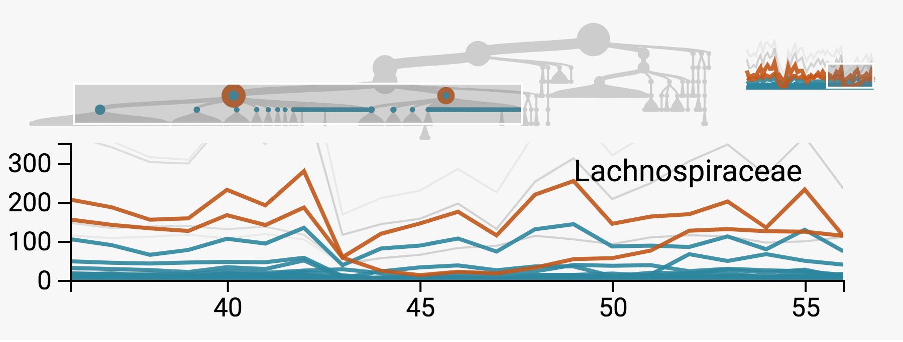
```

Alternatively, we can summarize each node by the average across its
descendants -- this brings attention to individual microbes that may
be underlying some of the broader taxonomic patterns we have noted
when studying the subtree sums. For example, in Figure
\@ref(fig:ruminococcus), we highlight all families below order
Ruminococcus, suggesting that the decrease due to antibiotics occurs
uniformly across almost all families. A point that was not evident in
the earlier sum-across-descendants view is that, after the second
treatment of antibiotics, a few of the Ruminoccocus families recover
more rapidly than the rest, for example the Unc095d3 (highlighted in
red) are only briefly affected. In contrast, most families seem to
recover in unison after the first treatment.

```{r ruminococcus, fig.cap = "By hovering over the Ruminoccocus branches, we see that there is a prolonged effect of the antibiotics time courses more or less uniformly across the lower taxonomic orders."}
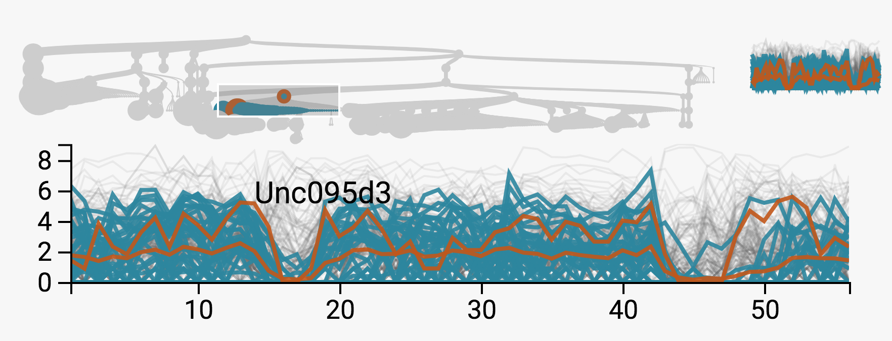
```

Further, note that in this subtree averages view, the tree display has
changed. This is because, at each branching point, we place the node
with larger average value on the left. This places the
Verrucomicrobiae at the far left, which seem to have large abundance
over many time points. This phylum had been previously obfuscated --
because there are not many leaves associated with this phylum, the sum
was small. Interestingly, the abundance of these microbes seems to
*increase* after the first antibiotics treatment.  Be cautious,
however, that the average over only a few Verrucomicrobiae species
will be a more variable estimate than the averages over the more
prevalent phyla.

```{r verrucomicrobiae, fig.cap = "The subtree averages aggregation brings attention to the Verrucomicrobiae, which though only present as a few species, are each rather abundant. In particular, they seem to increase after the first antibiotic time course."}
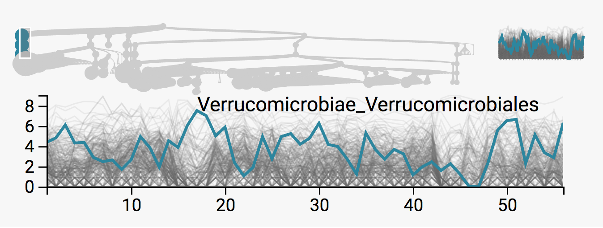
```

### Differential Microbial Abundance and Preterm Births ###

The study [@digiulio2015temporal] tracked the abundance of microbes in
the vaginal microbiome during pregnancy in an effort to study
relationships between microbial community composition and preterm
birth. Ideally, it would be possible to develop clear microbial
signatures associated with preterm births.

Unlike the antibiotics study, we have measurements across more
individuals than we could reasonably inspect one at a time. While we
could average across all individuals, we will take our cue from
[@digiulio2015temporal] and place each sample into one of five
Community State Types (CSTs), identified via k-medoids.  In that
study, a linear model identified one of these CSTs (CST 4) as
significantly more diverse, further it appeared associated with
preterm births. Here, we corroborate this finding using exploratory
views.

Therefore, our focus here is on the differential abundance question,
rather than dynamics.  We would like to provide visual representations
of differential abundance across CSTs and also between preterm and
non-preterm births. [@digiulio2015temporal] interpreted the CSTs using
a heatmap, with microbes ordered according to a hierarchical
clustering.  By using the DOI sankey instead, we can interpret the
CSTs in their taxonomic context and at multiple scales of taxonomic
resolution. Further, while [@digiulio2015temporal] focused on
identifying associations between preterm births and CSTs -- presumably
because testing individual microbes loses power -- we can compare
microbe abundances between preterm and non-preterm samples along
subtrees, without requiring CSTs as an intermediary.

In Figure \@ref(fig:pretermcsts), we compare the 5 CSTs according to
their values along the subtree. Specifically, we took the average of
all samples within each CST to define values at the (microbe-level)
leaf nodes, and then aggregated the averages up to the root. It is
immediately clear that samples from CST 4 have much more taxonomic
diversity. Further, focusing on the Lactobacillaceae family, we note
that the differential abundance of these microbes distinguishes the
remaining CSTs, see Figure \@ref(fig:pretermcstslacto).

Alternatively, in Figure \@ref(fig:pretermcsts), we avoid working with
CSTs, displaying instead averages among samples associated with either
preterm or term births. The green edges are associated with preterm
births -- we see that they contribute more weight to phyla outside the
Firmicutes. This is consistent with the claim that CST 4, the most
diverse of the CSTs, is associated with preterm births.

```{r pretermcsts, fig.cap = "The increased diversity among samples in CST 4 is represented by the relatively larger contribution of red edges to branches outside of the Firmicutes."}

```

```{r pretermcstslacto, fig.cap = "Zooming into the Lactobacillaceae family, we notice that the difference between the remaining four CSTs is related to which types of Lactobacillus are most prominent."}
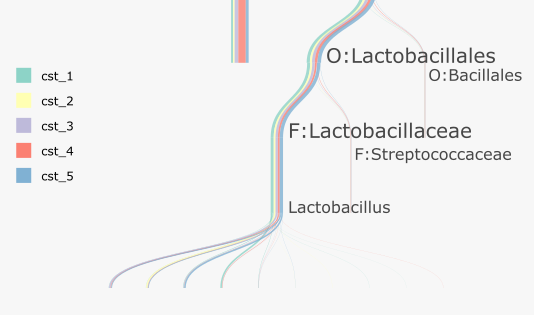
```

```{r pretermpreterm, fig.cap = "Samples with high levels of phyla other than Firmicutes appear to be related to preterm births."}
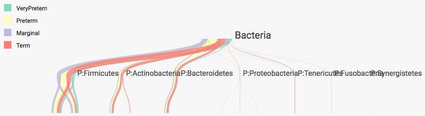
```

### Dynamics in Housing Prices {#zillow-study}

We next consider an application unrelated to the microbiome, but with
relatively clear hierarchical structure. Our data are downloaded from
Zillow^[[http://www.zillow.com/research/data/](http://www.zillow.com/research/data/)],
and give the Zillow Home Value Indexes at the neighborhood level,
across the country, computed monthly between 1996 and 2016. In our
display, we have taken the base 10 log of these indexes. As our
hierarchical structure, we use each neighborhood's assignment to
state, regional, county, and city levels. We represent each of these
coarser spatial categories using the average of all neighborhoods
contained in them. We have filtered down to the 890 neighborhoods in
California; rendering more neighborhoods while keeping all 246
timepoints causes the interface to lag^[See Section
\@ref(conclusion) for potential optimizations, however.].

Our basic analysis revolves around geographic and temporal variation
in home prices. We are especially interested in the effect of the 2008
recession and any variation in the lead-up to or recovery from this
event. These questions can be naturally framed using timebox trees and
treeboxes.

We first study variation in prices at the city level. These series can
be highlighted using a single brush in treeboxes, since each spatial
level is displayed at the same height in the tree. The resulting
display is given in Figure \@ref(fig:zillowcities). From a high level,
the housing bubble, decrease in prices due to the recession, and
subsequent recovery are readily apparent. The city-level view makes it
clear that not all neighborhoods were equally affected by the
recession -- richer cities plateaued at their 2008 prices,
middle-income cities saw moderate decreases, and poorer cities saw the
most significant declines in home prices. These more significant
declines tended to occur in cities that had recently seen rapid
increases during the housing bubble. Finally, we note that the range
in home prices seems to have increased after the recession, speaking
to the differential long-term effect of the recession on prices.

Alternatively, we can study the trajectories of home prices among
neighborhoods, conditional on their being middle-income before the
recession. We generate the sequence of views in Figures
\@ref(fig:zillowmiddlepre), \@ref(fig:zillowmiddleup), and
\@ref(fig:zillowmiddledown) to this end. The first of these figures
isolates neighborhoods with middle incomes before the recession, using
a single timebox. Since there appears to be a divergence in
trajectories after the recession, we introduce a second post-recession
timebox, dragging it over series with higher and lower incomes during
this second time period. This is the content of Figures
\@ref(fig:zillowmiddleup) and \@ref(fig:zillowmiddledown). Inspecting
the highlighted tree nodes associated with these series, we find that
most of the middle-income series that increased after the recession
are associated with middle-income neighborhoods within the coastal
Southern California counties. In constrast, those middle income series
that saw decreases were mostly located in Central California and
Oakland.

The previous analysis highlights the fact that, within even narrow geographic
regions, there can be substantial variation in prices. We can study this
directly using treeboxes. In Figure \@ref(fig:zillowsf) we have highlighted all
series in San Francisco County. We see that, in 2016, prices range from around
$10^{5.6} \approx \$400,000$ to $10^{6.7} \approx \$5 \text{ million}$. So, while
all these neighborhoods tend to be among the more expensive ones in California,
prices can vary in a non-smooth way across geographic space.

We conclude this example with a caveat that the Zillow data are not
representative of all neighborhoods in California, only those with
enough listings on the site, so should be supplemented by other data
sources for any substantial decision-making.

```{r zillowcities, fig.cap = "California home prices at the city level, between 1996 and 2016. The effect of the 2008 recession is clear, and we have hovered over the San Bernardino series, to display the identity of one of the cities most strongly affected by the recession."}

```

```{r zillowmiddlepre, fig.cap = "Neighborhoods with mid-range home prices before the recession are selected here. Note that the collection of series seems to widen after 2008 -- we are interested in whether there are reliable predictors of these alternate trajectories, given their similar starting points."}
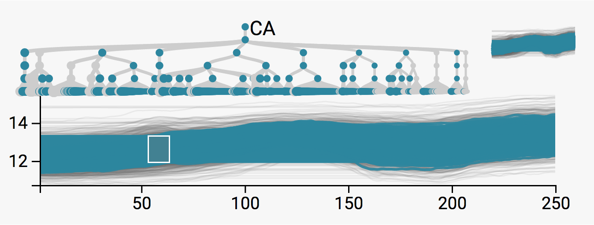
```

```{r zillowmiddleup, fig.cap = "Among those neighborhoods with mid-range prices before the recession, we have selected those that recovered more rapidly. These appear to be located mainly in Los Angeles and San Diego counties."}
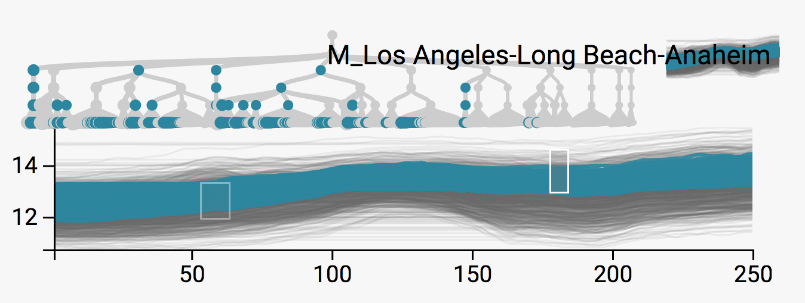
```

```{r zillowmiddledown, fig.cap = "Rather than selecting mid-range series that recovered quickly, we can isolate those whose prices remained depressed after the recession. These seem mostly to be located in Central California and the East San Francisco Bay Area."}
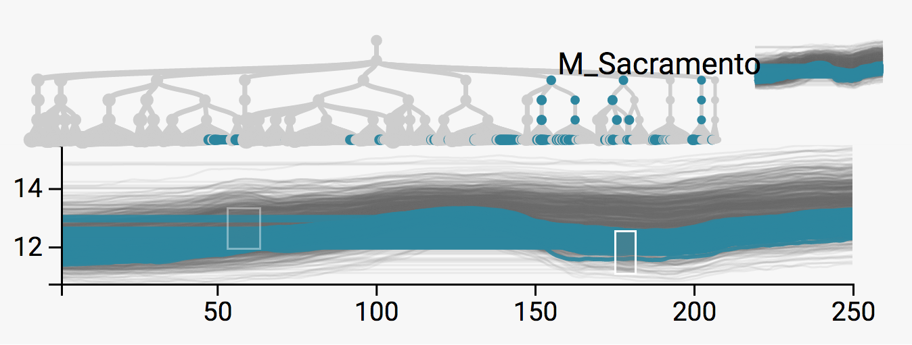
```


```{r zillowsf, fig.cap = "To study teh range in home prices within San Francisco County, we can select the associated nodes using a treebox."}
include_graphics("figure/zillow_sf.png")
```

### Sources of Variation in Bikesharing Demand {#bikesharing-study}

Our next example is a study in bikesharing demand, included as an
example of analyzing collections of time series when there is no
obvious hierarchical structure a priori. The data are available at
the UCI
Repository^[[https://archive.ics.uci.edu/ml/datasets/Bike+Sharing+Dataset](https://archive.ics.uci.edu/ml/datasets/Bike+Sharing+Dataset)]
and were originally collected by a Washington D.C.-based bikesharing
system for use in a Kaggle prediction competition. The data are hourly
measurements of bike demand, aggregated across all bikesharing
stations, over two years, along with supplemental weather data. In the
competition, participants were asked to predict the hourly demand on a
held-out test set. Here, we adopt a descriptive view instead,
attempting to characterize factors associated with variation in
bikesharing demand.

Like the Zillow home prices application, we study this problem as one
of describing a large collection of related time series. Here, we
consider the demand during a single day to be one time series; this is
a natural choice considering the daily periodicity of bike demand. To
arrange these daily series along an interpretable tree structure, we
apply a regression tree relating the supplemental data to the
bikesharing demand [@breiman1984classification]. In more detail, we
built this tree by noting the “two table” structure of this problem:
one describes bike demand, the other holds the supplemental data. In
both, the rows index days, while the columns index either hours or
supplemental features. Our tree is the trained regression tree after
predicting demand at 8AM based on the supplemental data. We choose
this response because (1) we need a univariate response in order to
apply regression trees and (2) the more straightforwards reduction to
daily-average-demand fails to distinguish between weekdays and
weekends, whose series appear qualitatively very different from each
other.

Given this response, the first split in the regression tree is
(unsurprisingly) the difference between weekends and weekdays. This is
emphasized in Figures 14 and 15, respectively; using timeboxes to
isolate the two types of series highlight the left and right sides of
the tree, respectively. For a more subtle effect, we select the
internal nodes associated with the first split below the weekday
vs. weekend split; these are given in Figures 16 and 17. This suggests
that weekday demand increased during the second year.

In contrast to these general questions about daily demand, we could
ask a more granular question about specific time windows. For example,
what characterizes days on which there is larger than average demand
after midnight? We can select these series after first zooming into
this time window. Figure 18 reveals that the highlighted series are
associated with the warm-weekend split, which seems quite reasonable
in retrospect.

Finally, we can study the behavior of the regression tree itself using
the DOI sankey. Here, we group samples according to their quintile of
8AM demand and then count the abundance of the groups flowing down
different branches. We find that the quintiles are each rather
strongly separated after descending even a few steps down the
regression tree – for example, Figures \@ref(fig:weekday2011) and
\@ref(fig:weekday2012) focus on 2011 vs. 2012 split among weekday
samples, showing that this split distinguishes between samples falling
in the second and third quintiles of 8AM demand.

This interactive representation of regression trees is potentially
more useful on larger trees that cannot be easily parsed in a single
view; in this sense the bikesharing tree is relatively simple. In our
ideal data analysis workflow, we imagine the analyst applying
interactive visualization and modeling techniques in an iterative,
nonlinear fashion.

```{r working, fig.cap = "The two peaks at rush hour distinguish weekday series from the rest."}

```

```{r weekend, fig.cap = "Unlike weekday demand, weekend demand is unimodal. The few weekday series with unimodal series seem to be associated with holidays. This is the case for New Years' Eve, which is currently hovered over in the tree."}
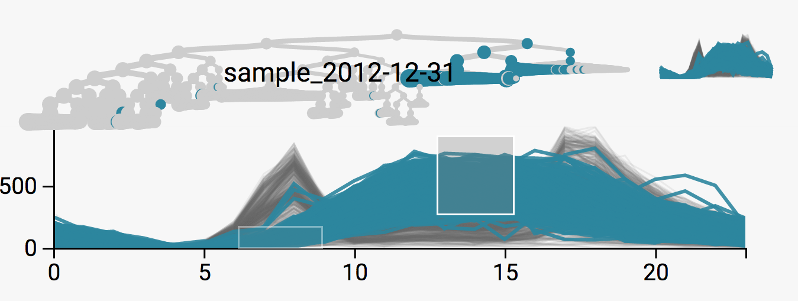
```

```{r weekday2011, fig.cap = "Weeday demand appears larger in 2012 than 2011 -- compare with the next figure."}
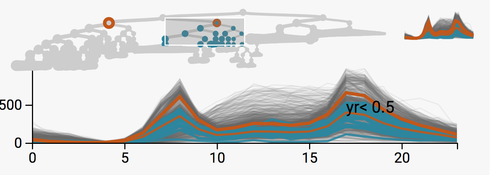
```

```{r weekday2012, fig.cap = "Weekday demand increased in 2012 -- compare with the previous figure."}
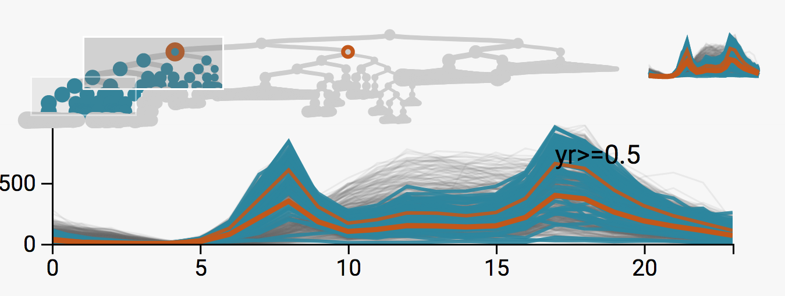
```

```{r warmweekend, fig.cap = "The samples with highest night demand tend to fall on warm weekends."}

```

```{r bikesankey, fig.cap = "We can interpret the regression tree using an interactive DOI representation."}
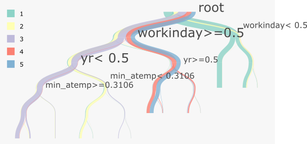
```

### Hierarchically Clustering the Iris Data {#iris}


Each of the timebox tree and treebox examples presented so far have focused on
data with a clear time component. We note however that these techniques could
alternatively be applied to high-dimensional data, via the use of parallel
coordinates [@inselberg1991parallel]. The usual parallel coordinates challenges
remain, namely selecteing scales for and an ordering across the different
coordinates, but the linking and focus-plus-context ideas can still be employed
in this setting. Here we provide a simple implementation of this idea, using the
famous Iris data, inspired by the hierarchical clustering vignette in
[@galili2015dendextend].

The Iris data set is a collection of 150 measurements of four variables --
widths and lengths of Iris sepals and petals [@fisher1936use]. There are 50
samples for each of three species of Iris, \textit{setosa}, \textit{versicolor}
and \textit{virgnica}. As in [@galili2015dendextend], we hierarchical cluster
samples\footnote{We use complete linkage and the euclidean distance.}. Our
contribution is to display the resulting hierarchy together with a parallel
coordinates view of the raw data, see Figure \@ref(fig:iristimebox).

```{r iristimebox, fig.cap = "A toy application to the Iris data gives an example of how linking in treelapse can be applied to combine hierarchical clustering and parallel coordinates views."}

```

From Figure \@ref(fig:iristimebox), the fact that the highest split in the
hierarchical clustering distinguishes those samples with small petal lengths
from the rest. Upon inspecting the associated IDs, we find that this cluster
includes all the samples from setosa. The similarity between versicolor and
virginica is reflected in their proximity in the clustering. Further, applying a
treebox view to scan the subtrees associated with these two species reveals the
more subtle differences in sepal and petal lengths that can be used to
distinguish them.

## Conclusion and Future Work {#conclusion}

Here, we have reviewed some fundamental principles of data
visualization and described their implementation in a new treelapse
package. Further, we have provided examples of the practical
usefulness of these principles in real-world data analysis situations.

This package has only developed basic ideas, and there are a number of
potentially useful extensions worth exploring. For example, we have
not considered the principle of arrangement in our visualizations
[@buja1996interactive], though many of our conclusions were based on
comparing alternative selections of the same display. We could imagine
faceting our displays across groups to make these types of comparisons
more accessible. Further, we have only worked with the DOI
distribution described in [@heer2004doitrees]. It would be interesting
to define a more statistical notion of interest along nodes, based on
cognostics, for example [@hafen2013trelliscope, @friedman2002john]. A
simple extension could be to allow graph layouts instead of trees in
time and treebox displays, for data that cannot be coerced into a
hierarchical structure. Finally, if these ideas turn out to be useful
in practice, it would be valuable to modularize the basic
visualization layouts and relationships into a library, allowing the
wider community to construct novel linked, interactive graphics with
minimal effort.

In summary, we have built an easily accessible R package for
visualization techniques in a very specific methodology problem –
analysis of differential abundance and dynamics in hierarchically
structured data – that appears in a variety of application domains. We
have leveraged a link between R and D3 [@vaidyanathan2014htmlwidgets]
to create exploratory visualizations while still deep in data
analysis; in this way our work is a departure from the culture of
polished, journalistic visualizations prioritized by the D3
community. Finally, we have given a series of examples to demonstrate
how the general visualization techniques of focus-plus-context and
linked brushing can be practically incorporated into a range of
practical analysis workflows, from studying the impact of microbes on
human health to better allocating units in commuter bikesharing
systems.

## References ##
